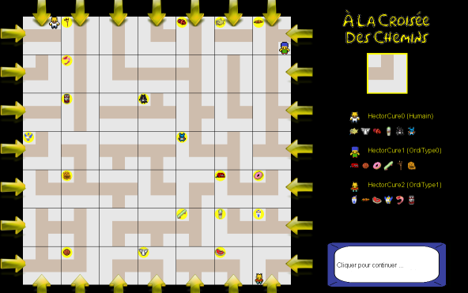

# Labyrinthe

# Info

Réalisation d'un clone du jeu de plateau Labyrinthe en Java. Ce projet a été fait en équipe. J'étais chargé d'assurer la communication dans mon équipe, ainsi que d'assurer la communication entre mon équipe et les enseignants. J'ai assuré la communication entre les enseignants et les étudiants pour qu'ils puissent voir l'évolution de notre projet ou pour que nous puissions poser des questions si nous en avions.